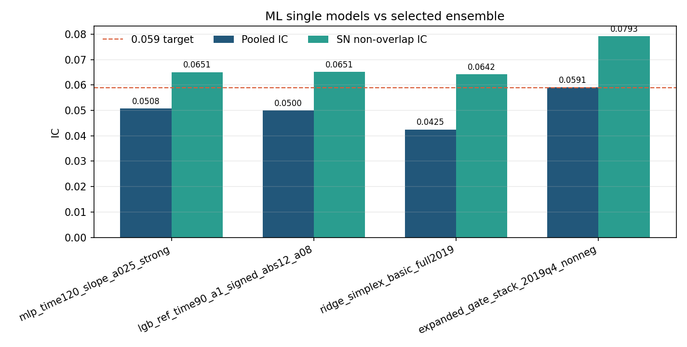

# ML Ensemble

Retained ensemble: `expanded_gate_stack_2019q4_nonneg`.

This is the best strict no-future-leakage ensemble found in the final pass. The
current three single models could be ensembled to roughly `0.057-0.058` pooled
IC, but did not clear the `0.059` target. The retained clean expanded stack did.

## Architecture

1. Build clean historical component streams from old clean models, old9 selected
   components, and selected new-factor family predictions.
2. Fit candidate gates on 2019Q1-Q3.
3. Select candidate gate configs by 2019Q4 validation.
4. Refit selected base configs on all 2019.
5. Fit a nonnegative second-level stack on 2019Q4 and audit on 2020.

Final nonzero stack weights:

| Base Config | Weight |
| --- | ---: |
| `old_old9_family_selected_xsz_month_equal_u090` | 0.837769 |
| `old_family_selected_raw_month_equal_u090` | 0.162231 |

All other saved stack weights are numerical zero.

## Comparison

| Model | Pooled IC | SN non-overlap IC | Dense CS IC |
| --- | ---: | ---: | ---: |
| MLP single | 0.050756 | 0.065097 | 0.060921 |
| LGB single | 0.050034 | 0.065138 | 0.067389 |
| Ridge single | 0.042481 | 0.064183 | 0.051803 |
| Current-three strict ensemble | 0.057293 | n/a | n/a |
| `expanded_gate_stack_2019q4_nonneg` | 0.059138 | 0.079266 | 0.076180 |

The original stack summary in `metrics/stack_summary.csv` reports
`pred_ic_2020 = 0.059218`. The standardized audit file reports `0.059138`
because it reconstructs the final prediction path inside the migration audit
script. Both are strict and both exceed the target.

## Files

| Path | Purpose |
| --- | --- |
| `model/expanded_gate_stack.py` | Second-level 2019Q4 nonnegative stack. |
| `model/expanded_history_gate_clean.py` | Clean historical candidate/gate construction. |
| `configs/selected_by_2019q4.json` | 2019Q4 selector result. |
| `configs/stack_base_configs.csv` | Base configs included in the second-level stack. |
| `weights/stack_weights.csv` | Final nonnegative stack weights. |
| `weights/base_gate_weights.csv` | Underlying base gate weights. |
| `metrics/best_ensemble_audit_metrics.csv` | Pooled/SN/dense audit metrics. |
| `figures/expanded_gate_stack_2019q4_nonneg_dashboard.png` | Monthly IC and 20-bin return dashboard. |
