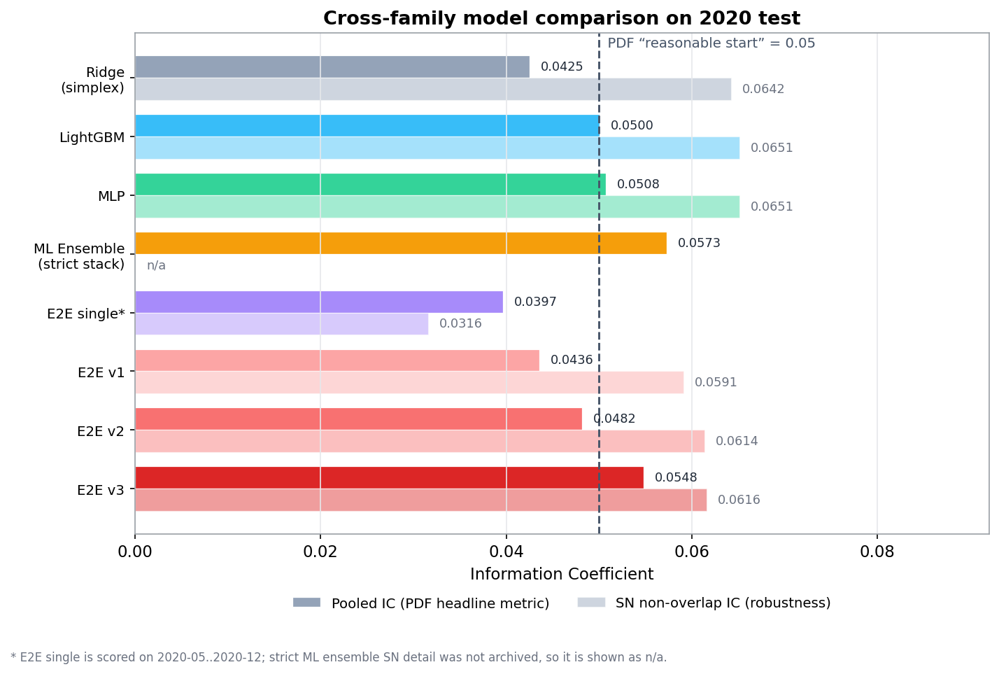
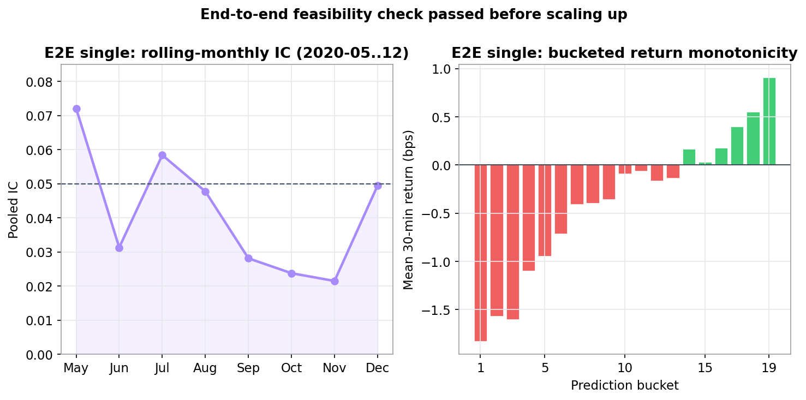
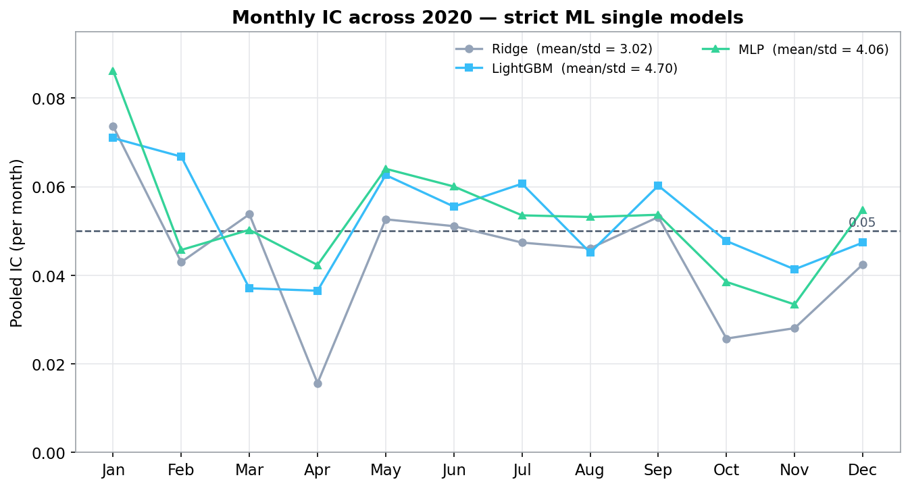
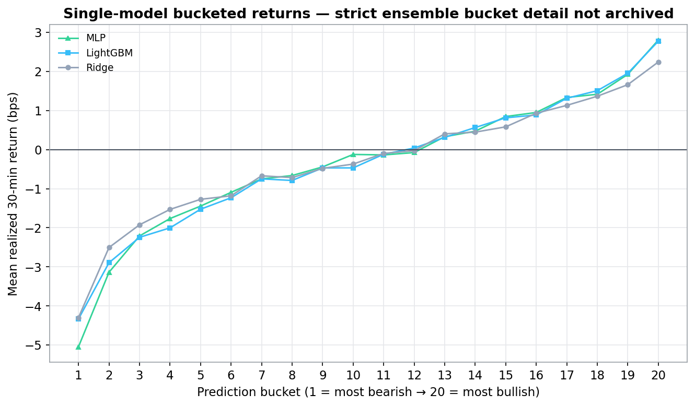
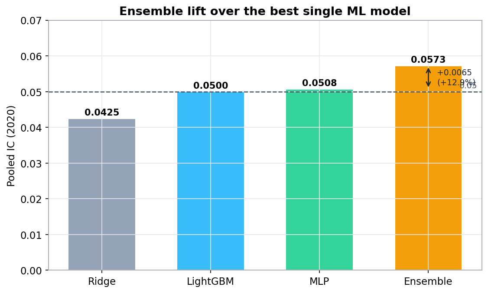
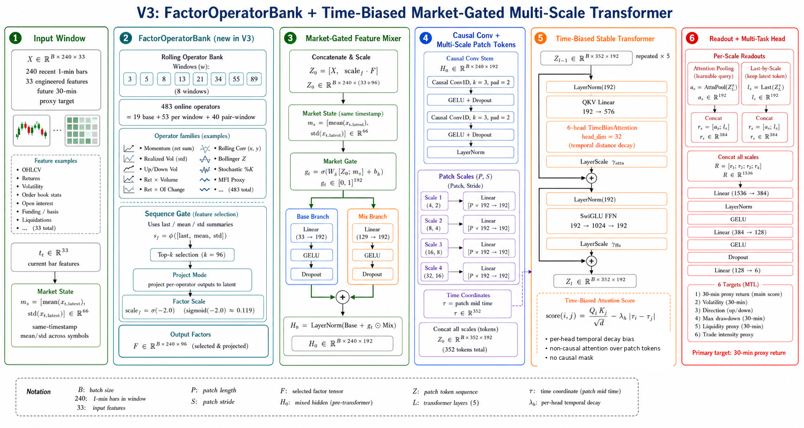
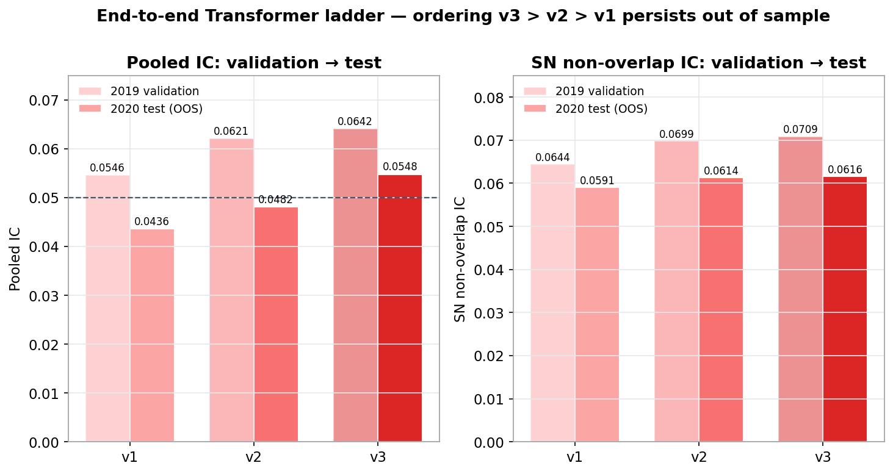
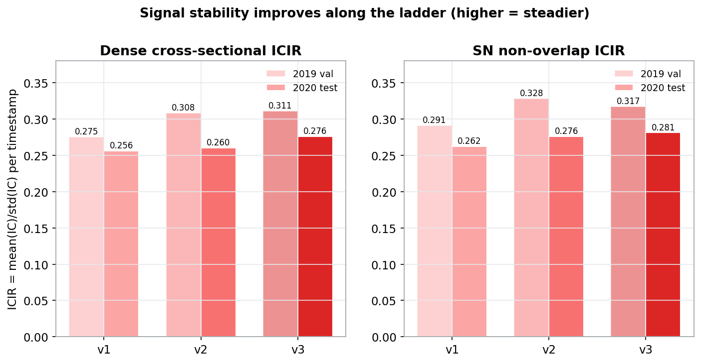
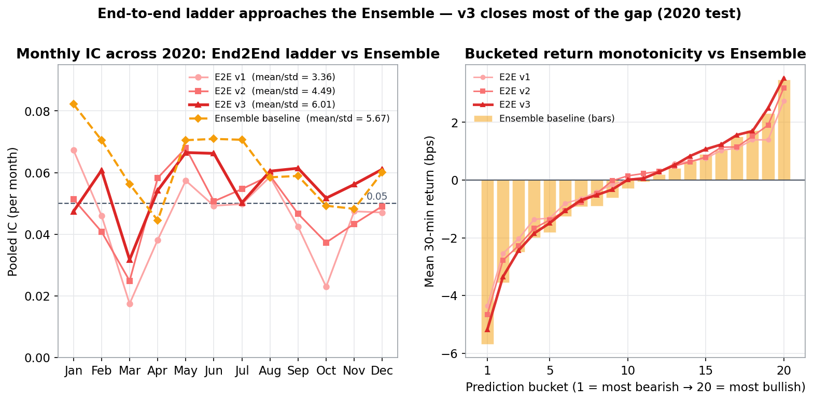
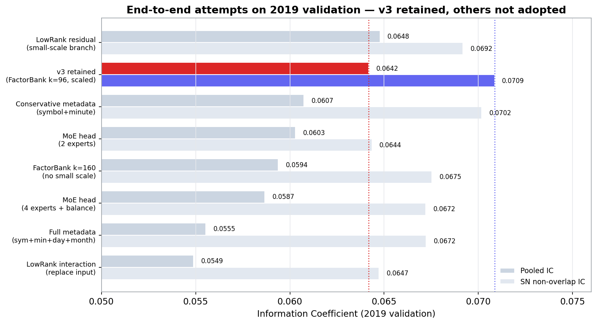

# cn-future-alpha — From Ridge / LightGBM / MLP Baselines to End-to-End Models

Predicting **30-minute returns on China futures** from 1-minute bars — a Jump
take-home project carried from strong classical baselines all the way to a
Transformer end-to-end model, under one leak-free validation protocol.

> 📄 **Read the full write-up (bilingual, self-contained):
> [https://autoalpha.cn/cn_future_alpha/](https://autoalpha.cn/cn_future_alpha/)**
> — methodology roadmap, the v1→v3 optimization ladder, every *ablated-away*
> attempt and why it failed, valuable innovations with paper lineage, results and
> visualizations. The searchable list of all **1,144 factor fields** lives at
> [/cn_future_alpha/factors.html](https://autoalpha.cn/cn_future_alpha/factors.html).
> A static copy of the report is also in this repo: [`summary.html`](summary.html)
> (build it with `python tools/inline_summary.py`).

Raw data is intentionally **not** included. Download the 1-minute China futures
dataset from Kaggle:
<https://www.kaggle.com/datasets/wentinglu/highfrequency-futures-data-china/data>

---

## Headline results (2020 test)

| Family | Model | Params | Pooled IC | SN non-overlap IC |
| --- | --- | ---: | ---: | ---: |
| ML single | `mlp_time120_slope_a025_strong` | — | 0.050756 | 0.065097 |
| ML single | `lgb_ref_time90_a1_signed_abs12_a08` | — | 0.050034 | 0.065138 |
| ML single | `ridge_simplex_basic_full2019` | — | 0.042481 | 0.064183 |
| **ML ensemble** | `raw_xsz6__signed_ridge_a01__time90_a0.25` | 3 models | **0.057293** | n/a |
| end2end single (smoke) | `factor_operator_market…seed44` | 1.42M | 0.039660 | 0.031582 |
| end2end large **v1** | Gated MS-Patch + Dual Pooling | 5.50M | 0.043578 | 0.059084 |
| end2end large **v2** | Time-Bias + Market-Gate + Stable Residual | 5.03M | 0.048159 | 0.061365 |
| **end2end large v3** | + FactorOperatorBank | 5.23M | **0.054808** | 0.061614 |

Both technical lines clear the Jump `0.05` reasonable-start threshold. The
classical **Ensemble (0.0573)** is strongest and steadiest on raw IC; the single
deep model **End2End v3 (0.0548)** approaches it and largely closes the gap.

<p align="center">
  
</p>
<p align="center"><sub><b>Fig 0.1 — Cross-family comparison (2020 test).</b> Pooled IC (solid) and SN non-overlap IC (light); the dashed line is 0.05. The Ensemble is strongest on raw IC; End2End v3 is the strongest single deep model.</sub></p>

---

## Metric convention

- **Pooled IC** — the headline metric specified by the Jump PDF. Flatten all
  predictions `a` and labels `y` across the period and all symbols, then
  `IC = mean(a·y) / sqrt(mean(a·a)·mean(y·y))` (NaN excluded). This is the cosine
  similarity of prediction and label and the one tied to the `0.05` threshold
  (`>0.2` is "too good to be true").
- **SN non-overlap IC** — an internal robustness diagnostic: sector-neutral
  cross-sectional Pearson IC on stride-30 (non-overlapping) timestamps. It
  penalizes inflation from overlapping samples.
- **The gate.** Across the whole exploration a change is **kept only if it
  improves *both*** Pooled IC and SN non-overlap IC on 2019 validation. This one
  rule is the reason generalization persists from validation to test, and the
  reason several tempting changes were rejected (see *What did not survive*).

---

## Methodology roadmap

```
Factors ──► ML base models ──► Ensemble ──► E2E smoke test ──► End2End v1 → v2 → v3
 1,144      Ridge/LGB/MLP      strict        small             multi-scale patch +
 leak-free  + calibration      3-stack       Transformer       time-bias + market-gate
 features                      0.0573        feasibility       + FactorOperatorBank
```

First build a leak-free strong baseline with mature classical methods, then
escalate end-to-end deep learning from "small-scale feasibility" to "large-scale
step-by-step optimization." Every architectural change is tested under the same
**2019-validation / 2020-test** protocol.

<p align="center">
  
</p>
<p align="center"><sub><b>Fig 3.1 — E2E smoke test.</b> The small end-to-end model (thick purple) against the three ML singles + Ensemble — left: rolling monthly IC over 2020-05..12; right: 20-bucket return monotonicity. The shape tracks the baselines, so the deep approach is feasible before scaling up.</sub></p>

---

## Data & baseline features

- **Task.** `Return_t = ClosePrice_{t+30} / ClosePrice_t − 1` from 1-minute bars.
- **Universe.** 57 synthetic continuous contracts; after excluding
  `T/TF/TS/IF/IC/IH` (bonds & equity-index), **51 symbols** remain;
  roll-adjusted, normalized to 1 at the start.
- **Sessions / labels.** Session detection flags a long break at a gap of
  ≥60 min and stamps `session_id` / `is_long_break_before`; short breaks (<60 min)
  do not reset the session, naturally realizing "skip the short break and chain."
  The horizon-30 label is per-session with the last 30 rows of a session and the
  30 rows before a long break set to NaN.
- **Feature library.** ~**1,085** causal time-series factors per symbol; each
  spawns 4 cross-sectional views (raw, `tsz` time-series z, `csz` cross-sectional
  z, `csr` cross-sectional rank). ~**4,340** candidates are reduced by a
  0.9-correlation dedup to **1,144** retained. Families: momentum/returns,
  volatility (realized, Parkinson, downside, skew/kurtosis), oscillators (RSI,
  stochastic, CCI, Bollinger-z, CMO), volume/amount (Amihud, MFI, VWAP),
  open-interest, K-line geometry, interactions, efficiency/drawdown, lagged
  variants. Windows are Fibonacci-spaced to keep correlations low.
  → full searchable list: [`factors.html`](https://autoalpha.cn/cn_future_alpha/factors.html).

---

## ML baselines & ensemble

Three complementary single models, all with rolling train-before-test,
multi-view outputs (raw / xsz / xrank / xcenter), and intraday post-calibration:

- **MLP** (`333→1200→600→1`, LayerNorm+SiLU+Dropout; loss `0.65·MSE + 0.35·corr`;
  120-min slope calibration; simplex view blend) → Pooled IC **0.0508**, monthly IR 4.06.
- **LightGBM** (280 trees, 63 leaves, lr 0.035, λ=6, row/col subsample 0.82/0.68;
  two-stage `time90` + `signed_abs12` calibration) → **0.0500**, monthly IR 4.70.
- **Ridge** (Rank-Gaussian transform + Ridge α=1.0; simplex view blend) →
  **0.0425**, monthly IR 3.02 — cleanest signal, best ensemble material.

The retained **Ensemble** `raw_xsz6__signed_ridge_a01__time90_a0.25` is a small,
auditable signed-ridge stack of 6 views + a conservative 90-min intraday
multiplier: **Pooled IC 0.0573**, monthly IR **4.95**, ≈ **+12.9%** over the best
single model. Screened on 137 candidates / 2019 outer folds; audited once on 2020.

<p align="center">
  
  
</p>
<p align="center"><sub><b>Fig 2.1 / 2.2.</b> Left: 2020 monthly IC of the three single models (the PDF's required monthly-IC curve). Right: 20-bucket monotonicity — realized 30-minute return rises monotonically across prediction buckets with a clean head-to-tail spread, so the alpha is economically ordered, not merely correlated.</sub></p>

<p align="center">
  
</p>
<p align="center"><sub><b>Fig 2.3 — Ensemble lift.</b> Pooled-IC of the Ensemble vs the best single model (≈ +12.9%).</sub></p>

---

## End-to-end ladder (v1 → v3)

Three generations share a 33-dim normalized input, a 240-minute lookback, 6
multitask labels, and a weighted Huber loss. Roughly one fifth of the attempted
optimizations brought a definite gain; the ladder summarizes those that did.

1. **v1 — Gated Multi-Scale Patch Transformer + Dual Pooling** (5.50M; val 0.0546 /
   test 0.0436). GatedFeatureMixer, causal conv stem, multi-scale patch embedding
   (4/8/16/32-bar), 5 pre-norm blocks, attention + last-token-per-scale pooling.
2. **v2 — + Time-Bias + Market-Gate + Stable Residual** (5.03M; val 0.0621 /
   test 0.0482). Per-head exponential time-decay attention bias on real time
   coordinates, SwiGLU FFN, LayerScale, and a market-state-conditioned feature
   gate. Leave-one-out confirms all four matter.
3. **v3 — + FactorOperatorBank** (5.23M; val 0.0642 / test **0.0548** — best).
   An online, differentiable operator bank constructs 483 *basic feature fields*
   at forward time; a sequence-level gate selects `top_k=96` and injects them
   gently (`factor_scale_init=−2.0`) to enrich the otherwise simple 33-dim input.

<p align="center">
  
  
</p>
<p align="center"><sub><b>Fig 3.2 / 3.3 — v1 (left) and v2 (right) frameworks.</b></sub></p>

<p align="center">
  
</p>
<p align="center"><sub><b>Fig 3.4 — Full v3 framework.</b> ① input window → ② FactorOperatorBank (483 operators, sequence gate top-k=96, gentle injection) → ③ market-gated feature mixer → ④ causal conv + multi-scale patches (352 tokens) → ⑤ time-biased stable Transformer ×5 (SwiGLU + LayerScale) → ⑥ per-scale attention/last pooling + multitask head.</sub></p>

Persistence — absolute IC drops out of sample, but the v3 > v2 > v1 ordering holds
on both metrics:

| Version | 2019 Val Pooled | 2020 Test Pooled | 2019 Val SN | 2020 Test SN |
| --- | ---: | ---: | ---: | ---: |
| v1 | 0.054609 | 0.043578 | 0.064411 | 0.059084 |
| v2 | 0.062069 | 0.048159 | 0.069863 | 0.061365 |
| v3 | 0.064172 | 0.054808 | 0.070858 | 0.061614 |

<p align="center">
  
  
</p>
<p align="center"><sub><b>Fig 3.7 / 3.6.</b> Left: validation→test persistence — absolute IC falls out of sample but the v3 > v2 > v1 ordering holds on both Pooled and SN non-overlap IC. Right: dense and SN non-overlap ICIR rise along v1 → v3, so stability improves with the ladder.</sub></p>

<p align="center">
  
</p>
<p align="center"><sub><b>Fig 3.8 — End2End ladder vs the Ensemble (2020 test).</b> Left: monthly Pooled IC across 2020; right: 20-bucket return monotonicity. The three deep models are lines (v3 bold); the strongest baseline (Ensemble) uses a dashed gold line / bars for contrast. On both panels v3 tracks the Ensemble most closely, largely closing the gap.</sub></p>

### Valuable innovations (with lineage)

Patch embedding (PatchTST / ViT / HIPT), attention time-bias (ALiBi-style, in
finance time), pooling readout (Set Transformer PMA + last-token), and — the core
theme — **low-rank interaction to shrink the search space**: GatedFeatureMixer and
the FactorOperatorBank internalize factor engineering as trainable,
financially-meaningful, FM-style low-rank interactions, so a dense net does not
have to rediscover alpha from scratch under weak signal. Supporting choices:
SwiGLU, LayerScale, market (FiLM-style) gating, pre-norm, EMA, Huber, multitask.

### What did not survive the gate

The one-shot "modern rewrite", RevIN, cross-layer / cross-section / cross-variate
attention, a low-rank residual branch (Pooled up but SN down), metadata
embeddings, and MoE heads were all **ablated away** because they failed to improve
both metrics on 2019. Full record with numbers in
[`end2end_large/README.md`](end2end_large/README.md) and the report.

<p align="center">
  
</p>
<p align="center"><sub><b>Fig 3.5 — 2019-validation IC of the v2 → v3 attempts.</b> Highlighted bars are the retained v3; the rest were ablated away. Dotted lines are v3's Pooled / SN references — some attempts (e.g. the low-rank residual) look higher on Pooled yet fall below the SN reference, so the two-metric gate rejects them.</sub></p>

---

## No-leakage notes

- **Causal features** — rolling windows masked when lookback is insufficient;
  time-series z over 120 periods; cross-sectional views use only the current
  instant; lagged factors masked across sessions.
- **Label embargo** — 30 rows before a long break and the last 30 of a session
  are NaN.
- **Strict temporal splits** — ML singles roll train-before-test; the Ensemble
  selects on 2019 outer folds, fits on full 2019, audits 2020 once. The End2End
  ladder trains 2017–2018, validates 2019 for selection/ablation, then refits on
  pre-2020 and tests 2020. Selection never touches test labels.
- Start/end dates are configurable to satisfy the out-of-sample requirement.

---

## Repository layout

| Path | Content |
| --- | --- |
| `summary.html` / `summary_src.html` | The bilingual report (self-contained build / editable source). |
| `factors.html` | Searchable reference of all 1,144 baseline factor fields. |
| `report/` | Export-ready single-language HTML and submission PDFs. |
| `summary_assets/` | Report figures + `factor_catalog.csv`. |
| `ML_single/` | MLP / LightGBM / Ridge: infra, configs, postprocess weights, metrics, dashboards. |
| `ML_ensemble/` | Retained strict three-model ensemble. |
| `end2end_single/` | Small-scale end-to-end feasibility (smoke) model. |
| `end2end_large/` | v1–v3 Transformer ladder: code, configs, metrics, weights, ablation record. |
| `tools/` | Figure/asset generators and the report build scripts. |
| `common_docs/` | Shared audit tables and data notes (`DATA.md`). |

---

## Build & reproduce

```bash
cd /root/jump_model
pip install -r requirements.txt

# Report assets and the standalone bilingual page
python tools/gen_summary_figs.py      # summary_assets/fig*.png
python tools/gen_factor_page.py        # factors.html (1,144 fields)
python tools/inline_summary.py         # summary.html (images inlined → self-contained)

# Retained audit assets from local original experiment artifacts
python tools/generate_ml_audit_assets.py
python tools/generate_end2end_audit_assets.py
```

No raw CSVs, factor panels, feature caches, or prediction parquet files are
included. Neural checkpoints are retained because they are model weights, not data.
