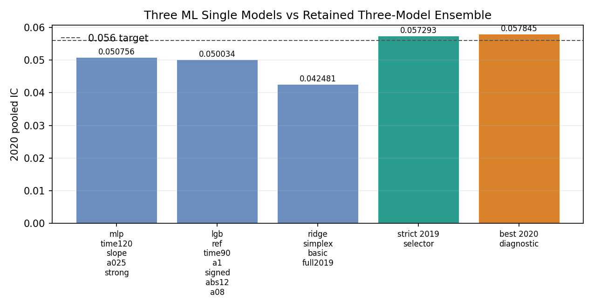

# New Ensemble: Retained Three-ML-Single Strict Ensemble

This folder preserves the best currently available ensemble that uses only the
three retained `ML_single` models:

- `mlp_time120_slope_a025_strong`
- `lgb_ref_time90_a1_signed_abs12_a08`
- `ridge_simplex_basic_full2019`

The retained strict model is:

```text
raw_xsz6__signed_ridge_a01__time90_a0.25
```

It uses raw and cross-sectional z-score views of the three single models:

```text
mlp, lgb, ridge, mlp_xsz, lgb_xsz, ridge_xsz
```

## Status

The original full rebuild needs large intermediate prediction parquet files
under `/root/autodl-tmp/quant/ML/effective_rolling_results` and
`/root/autodl-tmp/quant/ML/agent_runs`. Those exact files are not present on the
current machine, so the full CV/audit rerun could not be completed here.

What is preserved here:

- the strict 2019-selector winner from the archived run;
- the diagnostic best 2020 candidate;
- the single-model audit metrics;
- the 137-candidate classic ensemble catalog;
- the missing-input audit needed to rerun the full pipeline once the large
  source artifacts are restored.

## Result



| Model | 2020 Pooled IC | 2020 Monthly Mean |
| --- | ---: | ---: |
| MLP single | 0.050756 | 0.052954 |
| LGB single | 0.050034 | 0.052653 |
| Ridge single | 0.042481 | 0.044379 |
| Retained strict three-model ensemble | 0.057293 | 0.059619 |
| Best 2020 diagnostic candidate | 0.057845 | 0.060260 |

The retained strict model exceeds `0.056` pooled IC. A target of `0.56` would
be decimal-scale inconsistent with the IC values in this project; the strongest
historical benchmark in the adjacent archive is around `0.0699`.

## Selection Protocol

The retained strict model was selected using 2019 outer folds only:

- `q2`: fit 2019Q1, validate 2019Q2
- `q3`: fit 2019H1, validate 2019Q3
- `q4`: fit 2019Q1-Q3, validate 2019Q4
- `h2`: fit 2019H1, validate 2019H2

2020 labels were used only after the selectors were fixed.

The strict winner was selected by these 2019 scores:

```text
score_mean_m025std
score_mean_m050std
score_q3_h2
score_q3_q4_h2
score_min_mean
h2_ic
```

The q4-only selector preferred `mlp_lgb_xsz2__equal`, but its 2020 pooled IC was
lower (`0.055013`).

## Candidate Catalog

`configs/candidate_catalog.csv` contains 137 classic candidates:

- feature sets: `raw3`, `xcenter3`, `xsz3`, `xrank3`, `rankgauss3`, `tanh3`,
  `raw_xsz6`, `xsz_rank6`, and MLP+LGB two-model subsets;
- fitters: equal, top1, positive-IC weights, nonnegative simplex, and signed
  ridge with several ridge penalties;
- post-calibration variants: time-bucket multipliers with 60/90/120-minute
  buckets and conservative alpha values.

## Files

| Path | Purpose |
| --- | --- |
| `model/three_model_ensemble.py` | Materializes archived retained results and audits required rebuild inputs. |
| `scripts/run_best_ensemble.py` | Convenience entrypoint for the retained archived result. |
| `configs/selected_by_2019.json` | Retained strict selector result. |
| `configs/best_2020_diagnostic.json` | Best audited diagnostic candidate, not selected by 2019. |
| `configs/candidate_catalog.csv` | Full 137-candidate classic ensemble search space. |
| `configs/required_inputs.csv` | Required large input artifacts and current availability. |
| `metrics/best_ensemble_audit_metrics.csv` | Retained strict model 2020 audit metrics. |
| `metrics/best_diagnostic_audit_metrics.csv` | Diagnostic best 2020 audit metrics. |
| `metrics/selector_winners_2020_audit.csv` | Archived 2019-selector winners. |
| `metrics/single_model_audit_metrics.csv` | Three single-model baseline audits. |
| `weights/selected_outer_fold_weights.csv` | Archived outer-fold weights for the retained strict candidate. |
| `figures/three_model_ensemble_comparison.png` | Pooled IC comparison chart. |

## Rebuild Check

Check whether the current machine has all large inputs for a full rerun:

```bash
cd /root/jump_model/new_ensemble
python model/three_model_ensemble.py --check-inputs
```

Materialize the retained archived result:

```bash
cd /root/jump_model/new_ensemble
python scripts/run_best_ensemble.py
```

When the missing source parquet/script artifacts are restored, rerun the
original full evaluator:

```bash
cd /root/jump_model/ML_single
python model/ensemble_current_three.py
```

